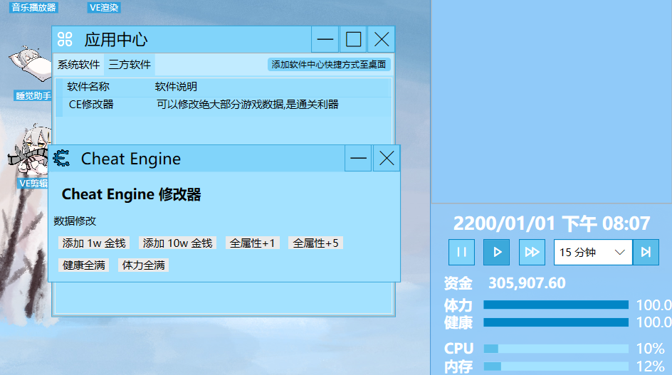

# 虚拟主播模拟器 公开资源与程序接口
虚拟主播模拟器 公开资源与程序接口


## 公开资源

* TODO

## 程序接口

通过使用虚拟主播模拟器程序接口, 您可以修改游戏中绝大部分内容和软件

***注意: 虚拟主播模拟器还在开发阶段,程序接口变动可能会比较大, 新版本可能不兼容旧版本接口或需要升级**

### 安装和引用

引用项目 `VUPSimulator.Interface`

或使用 [nuget.org](https://www.nuget.org/packages/VUPSimulator.Interface/) ^(暂未发布,因为还在开发中,变动比较频繁,就懒得上传了,请手动编译引用下)^

```bash
Install-Package VUPSimulator.Interface
```

### 编写

新建类库^(仅后端)^或WPF类库^(包括软件等前端)^项目
游戏与接口均使用 .net framework 4.62

新建类并继承 `VUPSimulator.Interface.MainPlugin`, 这将是游戏调用主要端口

### 项目结构

详细请参见代码注释,基本上都有且很详细

* Core - 核心
  * Core: 游戏文本/图片/资源等数据, 可以通过 `MW.core`调用
  * Save: 玩家存档数据 若未开始游戏则为空. 可以通过 `MW.save`调用
  * Source: 资源集格式
  * Theme: 游戏主题
* Handle - 接口
  * Function: 游戏通用方法, 常用的有 `Rnd`随机数生成 等
  * IMainWindow: 主窗体接口 开发者可通过此接口获取游戏信息和进行高级代码MOD开发
  * MainPlugin: 这是插件的主体内容 请继承这个类
  * SoftWare: 软件类, 添加至软件列表 以在软件中心显示
* Items - 物品类
  * Base: 物品基础类
  * Computer: 计算机相关物品类
  * Game: 游戏类
* Type - 其他类型
  * Comment: 评论类 包括视频,直播,游戏评价等
  * Event: 事件 从小的扣体力到大的故事链均使用这个类
  * Users: 用户信息
  * Video: 视频类 一般由玩家录制的视频(也有网站视频变种等)
  * VideoEditorType: 视频编辑选项类 编辑视频的选项
* UI - 用于显示的相关类型
  * IMCTag: 弹窗消息窗口,显示消息/日历
  * IWindows: 窗体, 会自动生成外边框和底部栏
  * WindowsPageHandle: 窗体内控件 请同时继承与Grid/UC以便进行窗体设计

### 发布

参考虚拟主播模拟器游戏MOD,编写相应 `info.lps` 和 将生成的dll置入 `plugin`目录下

如下方例子所示: [文件夹链接](https://github.com/LorisYounger/VUPSimulator.OpenResources/tree/main/VUPSimulator.Interface.Demo/1100_CheatEngine)

```
游戏目录\mod
	- \1100_CheatEngine
		- \image
		   ....
		- \plugin
			- CheatEngine.dll
			- LinePutScript.dll
			- ...
```

接着前往游戏上传至SteamWorkshop即可

***发布至Steam创意工坊需遵循[创意工坊协议]()及[虚拟主播模拟器创意工坊协议]()**

### 案例

参见 [CheatEngine](https://github.com/LorisYounger/VUPSimulator.OpenResources/tree/main/VUPSimulator.Interface.Demo) 游戏内数据修改作弊器


