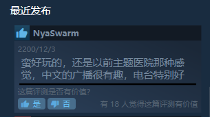
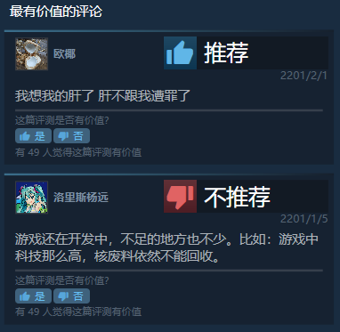
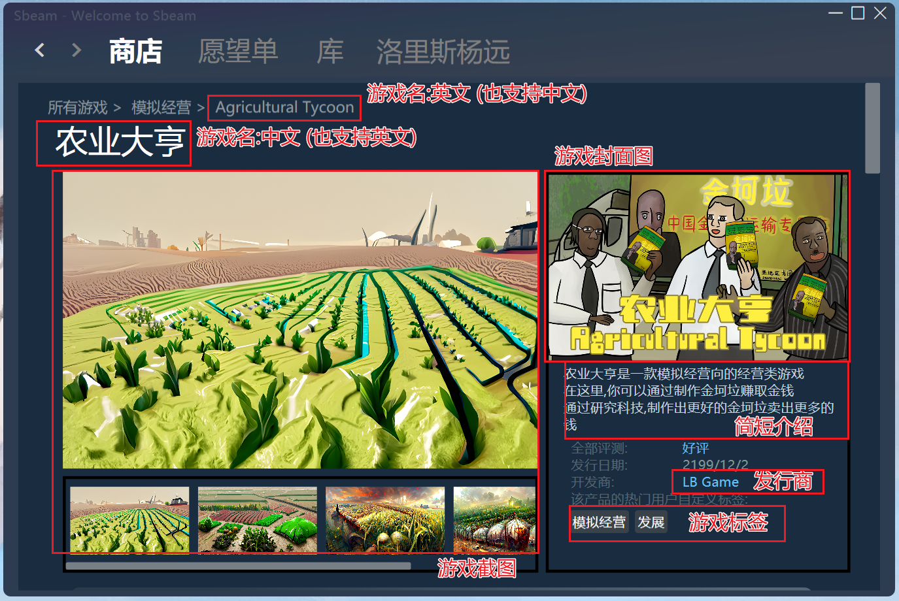
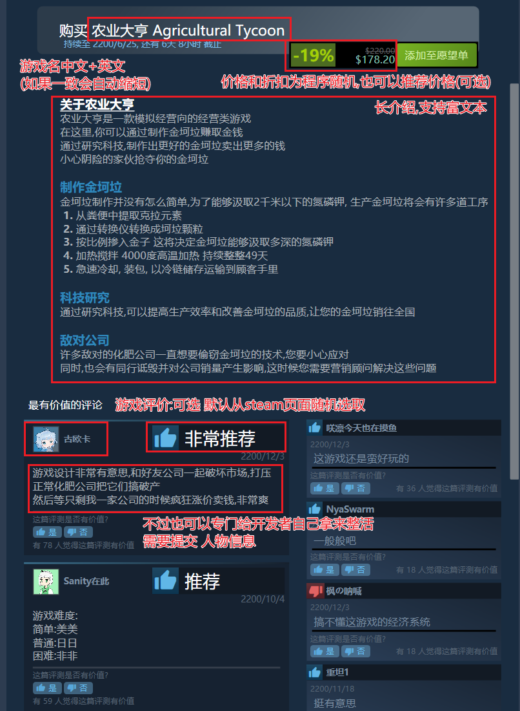
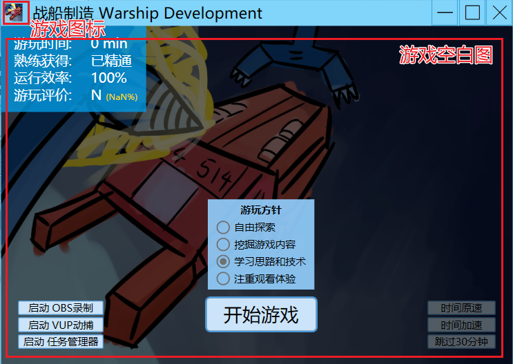
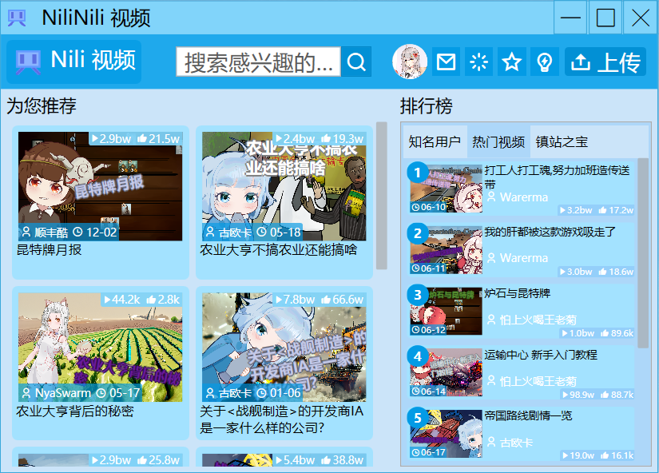
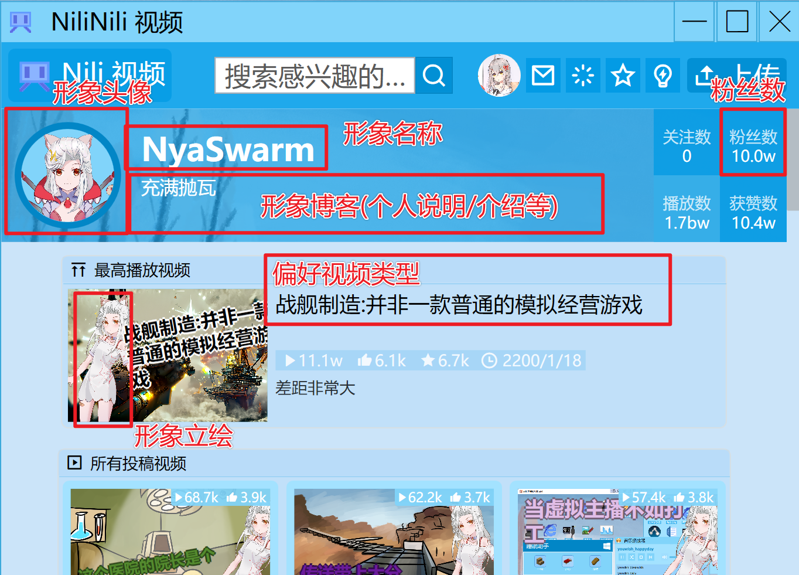

# 虚拟主播模拟器 素材征集

成为<虚拟主播模拟器>一部分! 

* 面向普通玩家 用户名/头像征集
* 面向游戏开发者 游戏征集
* 面向虚拟主播 立绘征集

## 普通玩家 用户名/头像征集

成为<虚拟主播模拟器>游戏NPC的一部分!

你的名字可能出现在游戏评论,弹幕或其他位置!

### +名字

允许中文或英文的组合
不允许特殊符号
多个名字按 英文逗号,分割

### +头像

从其他视频的截图,P站或其他画师的公开/私有作品(非自己约稿)均不可使用
我拥有头像的著作权和使用权,并愿意提供给<虚拟主播模拟器>使用
如果您的头像不是您创作的或没有权限,请不要提交
提交后视为授权给<虚拟主播模拟器>使用该头像至游戏中

## 游戏开发者 游戏征集

将您的游戏发布到 Sbeam! 您的游戏将会给玩家游玩!

### 提交前须知:

* 您所提交的游戏版权需归您所有并愿意授权(名字/介绍/等)给 <虚拟主播模拟器> 使用
* 您提交的游戏可能会遭受 '差评' 
* 玩家可能在游戏内对您的游戏做出不可知的行为 (例如:给发表评价/视频对该游戏)
* 游戏内并不会提供直达的链接至您的游戏或Steam页面 玩家感兴趣可能会去搜一下,不过大概率可能是不了了之, 宣传效果可能没想象的那么好.

### +游戏名

* 中文名
* 英文名

### +开发商

游戏开发商 (工作组/制作团队/制作人等)

### +游戏简短介绍

简单介绍游戏内容

### +游戏详细介绍

详细介绍游戏内容 支持富文本, 不支持图片 

### +游戏封面图

包含游戏 LOGO 等信息 比例推荐 1:1.6 1000x600 或任意宽图均可

### +游戏截图

游戏内画面截图,支持多张 任意宽图均可

### +游戏标签

游戏标签 支持多个,最大上限10个

### +游戏logo图

游戏 LOGO 

### +游戏库图

游戏库显示的图片 推荐 2.5:1 1250x500 或任意极宽图

### +游戏图标

游戏运行时图标 推荐1:1 64x64 或任意正方形图

### +游戏空白

运行游戏显示的图片, 推荐比例 1:1.6 1000x600 或任意宽图均可

### +游戏视频标题 (可选)

用于生成在 Nili(视频网站)的随机视频
格式: 视频名称|视频简介

### +自定义评价 (可选)

自定义玩家对游戏的评价, 默认从steam页面随机选取
格式: 用户名(可选)|好评/差评(0-100)|点赞人数(0-100)|评价内容
*自定义评价不会过多影响整体评价,还会有其他从评论和评价被引用

## 虚拟主播 立绘征集

成为 Nili 的视频发布者! 让玩家看看你的视频!

### 提交前须知:

* 您所提交的人物形象需归您所有(或工作室同意)并愿意授权(名字/介绍/等)给 <虚拟主播模拟器> 使用
* 您提交的人物形象可能会遭受各种正面或负面的事件 
* 玩家可能在游戏内对您的形象做出不可知的行为 (例如:玩家抹黑,下黑手给您的人物形象)
* 游戏内并不会提供直达的链接至您的个人页面 玩家感兴趣可能会去搜一下,不过大概率可能是不了了之, 宣传效果可能没想象的那么好.

### +形象名字

人物形象的名字

### +形象博客

可以是介绍,说明或者卖萌都行

### +形象头像

人物头像, 推荐大小500x500 或任意正方形

### +形象立绘

用于生成视频封面 推荐大小 800:1200 或 推荐比例2:3 或 竖长方形

### +偏好视频类型

系统将会更加偏向于生成相应类型的视频

* 杂谈
* 游戏
* 唱歌
* 绘画
* 编程

### +粉丝数 (可选)

默认选择当前虚拟主播的粉丝数量x2
*为了游戏性可能会进行一定调整和修改